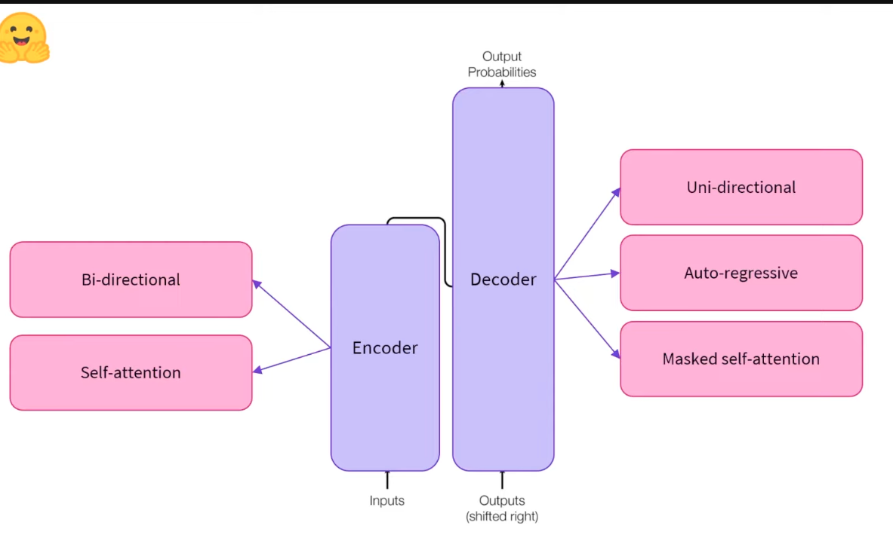

## encoders, decoders and encoder-decoder architecture 

Sources (Hugging Face course videos): The Transformer architecture · Encoders · Decoders · Encoder-decoders

From the paper *"Attention Is All You Need"* (Vaswani et al.). Split into 2 parts that work together or alone.

| | Encoder | Decoder | Encoder-decoder |
|---|---|---|---|
| Does | text → numbers (understands) | text → numbers, then generates next word | encoder understands, decoder generates |
| Attention | self-attention | masked self-attention | both |
| Direction | bi-directional (sees left + right) | uni-directional (sees one side only) | — |
| Example model | BERT | GPT-2 | T5 |
| Best at | understanding text | generating text | turning one sequence into another |

Key words:
| Term | Meaning |
|---|---|
| Embeddings / features / feature vector | the numbers that represent a word |
| Self-attention | each word's numbers are affected by the other words in the sentence |
| Auto-regressive | model's last output becomes its next input |
| Sequence-to-sequence (seq2seq) | another name for encoder-decoder |

---

### Encoder

**Example model:** BERT

How it works:
| Input | Output |
|---|---|
| "Welcome to NYC" (3 words) | 3 vectors, one per word |

- Vector size is set by the model. BERT base = **768** numbers per word.
- Each vector is **contextualized**: the vector for "to" includes info from "Welcome" (left) and "NYC" (right).
- That's **bi-directional** context, done by **self-attention**.
- So the 768 numbers ≈ the meaning of the word *in that sentence*.

Good at:
| Task | Example | Why encoder works |
|---|---|---|
| Masked language modeling (MLM) | "My [MASK] is Sylvain." → **name** | needs words on both sides; without "is Sylvain" it can't guess "name" |
| Sequence classification (e.g. sentiment) | positive / negative, 1–5 stars | understands the full sentence: 2 sentences with the same words can mean opposite things |
| Question answering | — | BERT was state of the art at release |

---

### Decoder

**Example model:** GPT-2

- Same idea as the encoder: one vector per input word.
- Can do most encoder tasks, with a bit less performance.

Main difference: **masked self-attention**
| | Encoder | Decoder |
|---|---|---|
| Vector for "to" in "Welcome to NYC" sees | "Welcome" + "NYC" | only "Welcome" ("NYC" is hidden) |
| Context | both sides | one side (usually left) |

Good at: **text generation** = causal language modeling (CLM) = natural language generation (NLG).

How generation works (auto-regressive):
| Step | Input | Model predicts |
|---|---|---|
| 1 | My | name |
| 2 | My name | is |
| 3 | My name is | (next word) |
| … | keep adding the output to the input | until you stop |

- The **language modeling head** turns the output vector into a score for every word the model knows → pick the most likely.
- GPT-2 max context = **1,024** tokens. It can generate up to ~1,024 words and still remember the first ones.

---

### Encoder-decoder (sequence-to-sequence)

**Example model:** T5

How it works:
| Step | What happens |
|---|---|
| 1 | Encoder reads the full input → numbers (runs **once**) |
| 2 | Decoder gets encoder output + a "start of sequence" token → outputs word 1 |
| 3 | Decoder gets encoder output + word 1 → outputs word 2 |
| 4 | Repeat until a stop token (e.g. end of sequence) |

Encoder is used once. Decoder is used many times.

Example: translation (also called transduction), "Welcome to NYC" → French
| Decoder input | Output |
|---|---|
| [start] | Bienvenue |
| Bienvenue | à |
| Bienvenue à | NYC |

Why use it:
| Reason | Example |
|---|---|
| Input and output lengths can differ | "Transformers are powerful" (3 words) → 4 French words |
| Encoder and decoder usually **don't share weights** | encoder specializes in understanding, decoder in generating: can be a different language, or even images / speech |
| Different context sizes | summarization: long context for encoder (full text), short for decoder (summary) |

- You can also combine any encoder + any decoder into one encoder-decoder model in 🤗 Transformers.

---

### Which one to pick

| Task | Use |
|---|---|
| Classification, sentiment, fill-in-the-blank, question answering | Encoder (BERT) |
| Text generation | Decoder (GPT-2) |
| Translation, summarization | Encoder-decoder (T5) |
